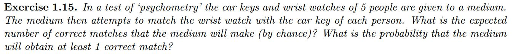

## 1.1 Introduction

## Study Guide

In this class, we will be looking at  machine learning concepts, and how they relate to probabilistic reasoning. Therefore, the readings and pre-class work focus on ensuring that you have a basic understanding of probability and how to solve Bayesian calculations.

It might be helpful to read the probability section first from the readings, depending on your previous understanding of probability theory. When you come to class, you should be able to solve word problems that require a straightforward application of Bayes’ theorem (such as those given in the pre-class work).

### Probability

**The following are some relevant takeaways from the first reading on probability:**

The probability of both events *x* and *y* occurring (joint distribution):

The probability of either event *x* or *y* occurring:

**Bayes’ Rule:** the probability of event *x* given that we know event *y* (conditional probability)

A probability density function (PDF) is used for a continuous random variable, where the integral across an interval gives the probability of the variable lying within that interval, therefore:

The generative approach to machine learning  with Bayes’ aims to optimize the parameters which fit the observed data. This can be understood through the terms: *prior*, *likelihood* and *posterior.* 

The **prior** probability is assumed without reference to any observation. Depending on the model we might want to assume a uniform prior probability distribution (all events are equally likely) or a Gaussian prior probability distribution (bell-shaped distribution). 

**Likelihood** is the conditional probability where, given the parameters, how “likely” is the data.

And finally, the **posterior** is the odds of the parameters, given the data and can be calculated through a weighted combination of the prior and the likelihood:

In other notation,

where, θ is the parameters and D is the data.

[This visualisation](https://micl.shinyapps.io/prior2post/) might help to understand how these concepts work together.

### Machine Learning Concepts

After reading Chapter 13 of Barber, you should be able to distinguish between supervised and unsupervised machine learning models with examples. 

## Pre-class work

### 1. Probability Calculations

Make sure that you can comfortably answer the following questions in Barber:

Write out short answers to each solution and bring them to class, in such a format that you can easily paste them into a poll.

### 2. Monty Hall Problem

Read the *Wikipedia* article on the [Monty Hall Problem](https://en.wikipedia.org/wiki/Monty_Hall_problem) and write out a full Bayesian solution. Be sure to state all probabilities that are known at the beginning, before going on to calculate **P(Win | Switch)** and **P(Win | Don't Switch)**. You will need to know how to solve similar problems during the class session.
