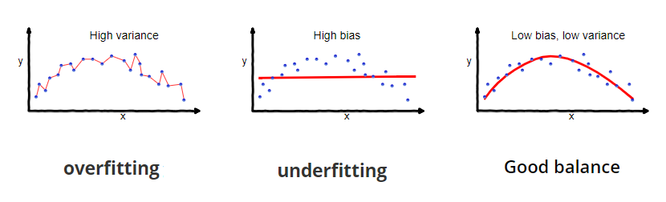

## 2.1 Ensuring Quality When Training

## Study Guide

### Cross-Validation

In order to analyze the accuracy and other model metrics, it is necessary to split the data into a training set and a test set. The model is fitted according to the training set, and then tested on the test set. If we were to test the model on the same data which it was trained on, then we will fall victim to **overfitting**, where the model works very well on the trained data, but is not generalizable to new data. 

Furthermore, we need to be wary of overfitting when experimenting with the model parameters. You should come to class able to explain how and why:

- a validation set can prevent overfitting
- cross-fold validation works

### Bias-Variance Tradeoff

**Bias** is the difference between the actual value of the data we are trying to predict, and the average prediction. Machine learning models which have a high bias usually underfit the data and perform poorly on both training and test data.

**Variance** is the variability of the model prediction based on the spread of the data. Machine learning models which have a high variance usually overfit on the training data and therefore perform very well on training data, but are not generalizable to test data. 

The diagram below [(Singh, 2018)](https://towardsdatascience.com/understanding-the-bias-variance-tradeoff-165e6942b229) shows an example of a model (red line) and how the bias/variance tradeoff affects its fit to the data:

You should come to class with a sound explanation for the strategy that you followed when training both the regression and classification models from your pre-class work.

## Pre-class work

### 1. Facebook Regression

The [following Facebook dataset](https://drive.google.com/a/minerva.kgi.edu/file/d/0B2UmDN6hOx7IR0lIZG1qYTlPR0k/view?usp=sharing) has been prepared.

**Here is a short sample of the data:**

| `total_followers` | `type`  | `category` | `month` | `weekday` | `hour` | `paid` | `comment` | `like` | `share` |
| :---------------- | ------- | ---------- | ------- | --------- | ------ | ------ | --------- | ------ | ------- |
| `136909`          | `Photo` | `1`        | `10`    | `1`       | `24`   | `0`    | `14`      | `404`  | `104`   |
| `136737`          | `Photo` | `1`        | `10`    | `1`       | `23`   | `1`    | `0`       | `0`    | `0`     |
| `137310`          | `Photo` | `2`        | `10`    | `1`       | `17`   | `0`    | `31`      | `1723` | `115`   |
| `136617`          | `Photo` | `3`        | `10`    | `7`       | `24`   | `0`    | `2`       | `76`   | `17`    |
| `136799`          | `Photo` | `1`        | `10`    | `7`       | `18`   | `0`    | `0`       | `15`   | `4`     |
| `136693`          | `Photo` | `1`        | `10`    | `6`       | `1`    | `1`    | `4`       | `72`   | `10`    |
| `136291`          | `Photo` | `1`        | `10`    | `6`       | `18`   | `0`    | `51`      | `1165` | `167`   |

**The input variables:**

- `total_followers`: The number of followers of the group.

- `type`: Specifies whether it is of type "photo," "status," or "link."

- `category`: There are three distinct categories; 1, 2, and 3.

- `month`: The month that the post was created.

- `weekday`: The day of the week that the post was created.

- `paid`: A 0/1 flag indicating whether the post was a paid-for promotion. 

  

**The output variables:**

- `comment`: The number of comments that the post generated.

- `like`: The number of likes that the post generated.

- `share`: The number of shares that the post generated.

  

**Now, do the following:**

1. Build a regression model by minimizing the mean squared error (MSE) to predict any of the:
   - comments,
   - likes,
   - shares.
2. Using your model, quantify how much the different input variables predict the influence of a post. Is there any interesting or unexpected behavior that your model predicts?
3. Make sure that your model is easily-accessible when in class and is able to predict new data of the same format, and quantify how well your model is doing. Ideally, this will include plots of the new data and your predictions.

**The data set is slightly modified from the original:**

*Moro, S., Rita, P., & Vala, B. (2016). Predicting social media performance metrics and evaluation of the impact on brand building: A data mining approach. Journal of Business Research, 69(9), 3341-3351*

### 2. Casualty Classification

The [following road casualities dataset](https://drive.google.com/a/minerva.kgi.edu/file/d/0B2UmDN6hOx7IOWpGMk05UlExeXc/view?usp=sharing) has been prepared.

**Here is a short sample of the data:**

| `casualty_class` | `gender` | `age` | `severe` | `pedestrian_location` | `pedestrian_movement` | `travel` | `year` |
| ---------------- | -------- | ----- | -------- | --------------------- | --------------------- | -------- | ------ |
| `passenger`      | `male`   | `42`  | `False`  | `Unknown`             | `N/A`                 | `car`    | `2006` |
| `passenger`      | `female` | `19`  | `False`  | `Unknown`             | `N/A`                 | `car`    | `2006` |
| `passenger`      | `male`   | `20`  | `False`  | `Unknown`             | `N/A`                 | `car`    | `2006` |
| `passenger`      | `female` | `18`  | `False`  | `Unknown`             | `N/A`                 | `car`    | `2006` |
| `passenger`      | `male`   | `43`  | `False`  | `Unknown`             | `N/A`                 | `car`    | `2006` |
| `passenger`      | `male`   | `20`  | `False`  | `Unknown`             | `N/A`                 | `car`    | `2006` |

**The input variables are:**

- `casualty_class`: One of "passenger," "driver," and "pedestrian."
- `gender`: Male of female.
- `age`: Age of the casualty in years.
- `pedestrian_location`: This field is only valid for pedestrian casualties and specifies where the pedestrian was when the incident occurred.
- `pedestrian_movement`: This field is only valid for pedestrian casualties.
- `travel`: One of "bicycle," "pedestrian," "motorbike," "car," "bus," "taxi," and "other."
- `year`: The year in which the casualty occurred.

And the **output variable** will be `severe`, which indicates whether or not the person was severely injured or not.

**Now do the following:**

1. Build a classification model to predict whether a casualty is severe or not. Your model should aim to maximize the accuracy of its predictions.
2. Using your model, quantify how much the different input variables predict the output variable. 
3. Make sure that your model is easily-accessible when in class and is able to predict new data of the same format, and quantify how well your model is doing. Ideally this will include plots of the new data and your predictions.

**This dataset is slightly modified from the original:**

*Road Casualties by Severity. (2014, September 10). Retrieved February 23, 2017, from https://data.london.gov.uk/dataset/road-casualties-severity-borough* 
