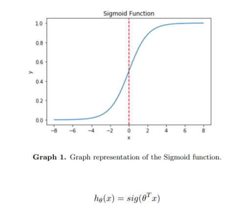
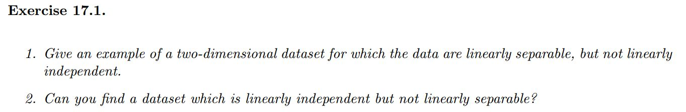
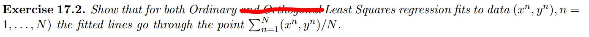
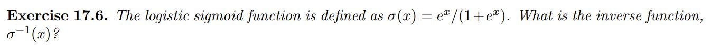
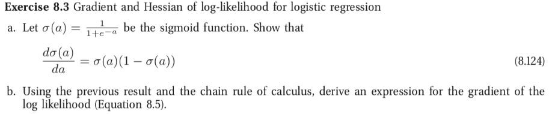

# 3.2 Logistic Regression

## Study Guide

Logistic regression is a classification algorithm used in machine learning which predicts the probability of data falling within a particular category.  Logistic Regression relies on the Sigmoid function (first equation below) as a base for the model (second equation below):

Here, *x* is the input feature(s) and θ is the parameter(s) which is defined from the training data fitted to the classifier. Inserting θT*x* into the sigmoid function bounds the output between 0 and 1, which acts as a probability estimation for the classification of the input. For example, the closer the output is to 1.0 the more likely that the input falls in Class 1. 

As noted in the readings, we can also add a bias parameter *b*, to the model “which shifts the decision boundary by a constant amount.” (Barber, 2012)

**After completing the reading, you should be able to answer the following questions in your own words:**

- How does the gradient ascent algorithm train a logistic regression classifier?
- What happens to maximum likelihood logistic regression if the data is linearly separable?
- Note that a generative model models the distribution of each class, while a discriminative model models the decision boundary between the classes. Therefore, is logistic regression a generative model or a discriminative model?

## Pre-class work

### 1. Barber Textbook Exercises

### 2. Murphy Textbook Exercises

