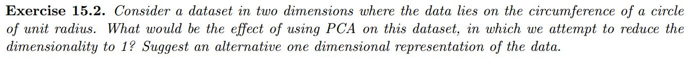

## 4.1 Principal Component Analysis

## Study Guide

Principal Component Analysis is a dimensionality reduction technique using an orthogonal projection of data on a vector (‘component’) to maximize variance of the data. Refer to the diagram below [(Williams, 2016)](http://alexhwilliams.info/itsneuronalblog/2016/03/27/pca/):

Given the data points (black), PCA fits a line on which the data is projected orthogonally. The first principal component is the line that maximizes the squared distance (and therefore the variance) between the projections (left figure), or minimizes the orthogonal squared distance between the data and line (the residuals for a fitted line -- right figure). 

The second principal component is orthonormal to the first one, and so on. This means that there can be as many principal components as dimensions in the original data.

After having done the reading you should be able to:

- Prove that the eigenvectors that one obtains from PCA are orthonormal to each other.
- Explain in your own words, what the criterion of maximum variance in PCA is, and why it might be useful.
- Explain in your own words how PCA can be used to make a nearest neighbor classifier more efficient.

## Pre-class work

### 1. Barber Exercise

### 2. Eigenfashion
Read the articles [here](https://medium.com/hackerati/eigenstyle-8c52cc979029) and [here](http://joelgrus.com/2013/06/24/t-shirts-feminism-parenting-and-data-science-part-2-eigenshirts/).

Now find the dataset from [Image Net](http://www.image-net.org/%20%22Image%20net%22), as given at the bottom. They contain examples of Jerseys, Shirts, Men's clothing and Women's clothing. Decide on an interesting binary classifier to build (e.g. men's shirt vs women's shirt, or jerseys vs shirts), and choose at least 200 images suitable for building such a classifier.

Resize and crop all the images programmatically so that they all have the same dimensionality. The snippet `load_images.py` may be of help if you get stuck.

Now perform a PCA analysis of your dataset. How many eigenvectors should you use for a reduced representation? Give a few examples of what your original images look like under your new representation.

To answer this question you might find the [following](https://scikit-learn.org/stable/auto_examples/decomposition/plot_pca_iris.html) [tutorials](http://scikit-learn.org/stable/auto_examples/decomposition/plot_faces_decomposition.html) useful.

The data files for each clothing set are available here:

- [Jerseys](https://course-resources.minerva.kgi.edu/uploaded_files/mke/YpANOV/jerseys.zip)
- [Shirts](https://course-resources.minerva.kgi.edu/uploaded_files/mke/rQb8dn/shirts.zip)
- [Male Clothing](https://course-resources.minerva.kgi.edu/uploaded_files/mke/nA93zn/male-clothing.zip)
- [Female Clothing](https://course-resources.minerva.kgi.edu/uploaded_files/mke/VL14ar/female-clothing.zip)
