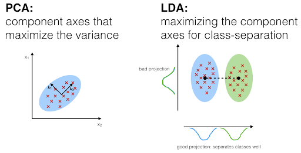
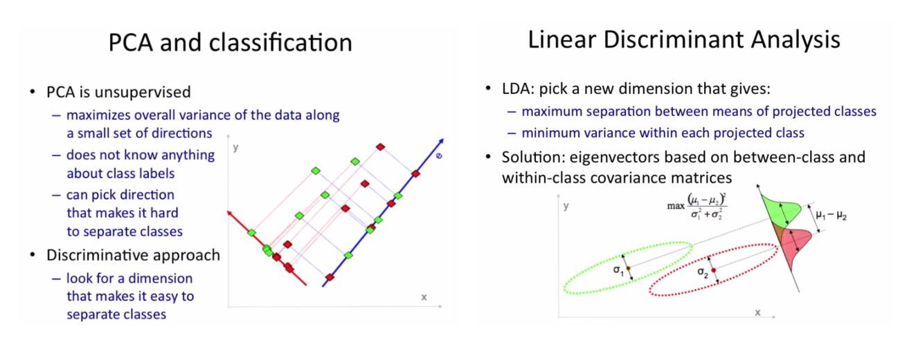

## 4.2 Fisher's Linear Discriminant

## Study Guide

Linear Discriminant Analysis is a dimensionality reduction and classification technique that projects data on a discriminant such that it maximizes the difference between classes. 

To calculate LDA, you need to (1) calculate the between-class distance, (2) calculate the within-class distance and (3) construct a lower dimensional space in which between-class distance is maximized and within-class distance is minimized.

The following graphics from the Raschka (2014) reading and Lavrenko (2014) video, respectively, are helpful for differentiating between PCA and LDA.

At the end of the prescribed reading, you should be able to:

- Describe in your own words how LDA is different from PCA. You might want to fill in the table below in order to clearly outline some of the main differences.
- List the assumptions that underlie LDA, and describe when LDA might not be appropriate.
- Describe in your own words what happens to Fisher's naïve Linear Discriminant if there are fewer data points than dimensions.

### PCA versus LDA Table

|                                               | Principal Component Analysis | Linear Discriminant Analysis |
| --------------------------------------------- | ---------------------------- | ---------------------------- |
| What is the component/discriminant?           |a combination of the original axes|an axes that maximize the separation
| Is this technique supervised or unsupervised? |         unsupervised         | supervised, relying on classes labels  
| What is maximized?                            |            variance          | separation between mean of the groups.                 
| What is minimized?                            |     MSE to the new dimension |  within class variance 
| Assumptions         |  Linearity(Assumes the data set to be linear combinations of the variables.) The subspace is linear(cannot be a curve)) | data are normally distributed, and each classes has identical covariance matrices

Failure scenarios | sensitive to large values (larger variance) | best way to separate might not be the mean

## Pre-class work

### 1. Discriminating Fashion

Using your dataset from the previous class (4.1) perform an LDA analysis of your dataset. Project the data down to a single dimension, and find the best classification accuracy that you can get on your dataset.

Upload your code to your pre-class work repository before class, and be prepared to discuss your results during the class.