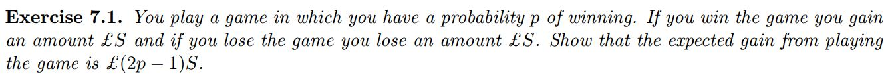

## 5.1 Bayesian Decision Theory

## Study Guide

After the reading you should feel comfortable answering simple word problems that use utility in order to make a decision. These problems will:

- List the different possible outcomes
- Give the probability of each outcome
- Give the utility of each outcome

Using the information given, you will be asked during class to make a decision and show your calculations.

## Pre-class work

### 1. Barber Exercise

### 2. Playing the Lottery

You see that a lottery is advertising that it has a record-breaking payout of $100,000,000. To win the lottery you need to correctly pick 6 numbers from 49 possibilities (without replacement). It costs $10 to enter, and if you enter now then you can daydream about all the things that you would do with the money. 

Alternatively, you can go and watch a movie with the money instead. You estimate that the movie will be 10% more enjoyable than the daydreaming, but winning the lottery will be one million times better than the movie.

- Should you play this lottery? Explain your reasoning (and/or calculations)
- What is the expected financial impact if you play this lottery?

Write up short solutions and upload to your personal repository before class.  Be prepared to discuss your solutions during the class.
