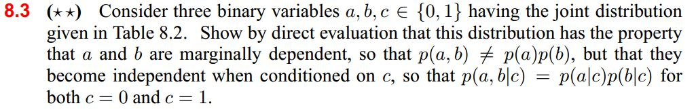
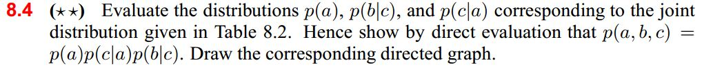
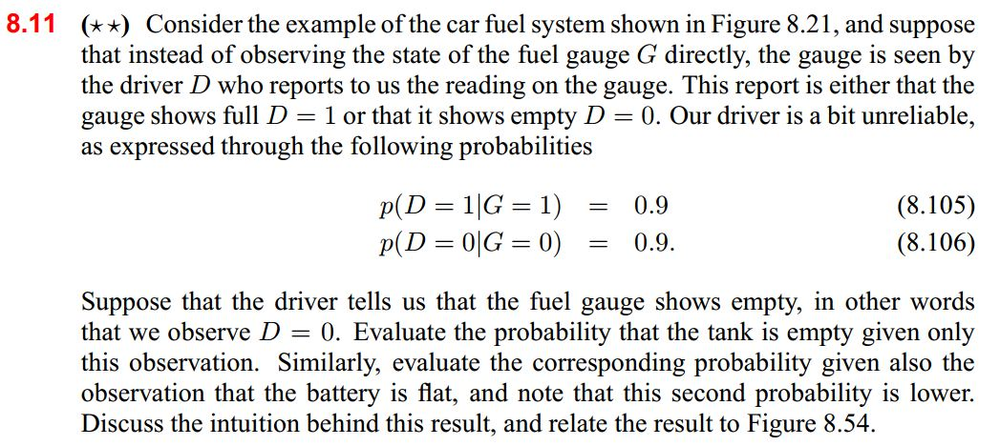
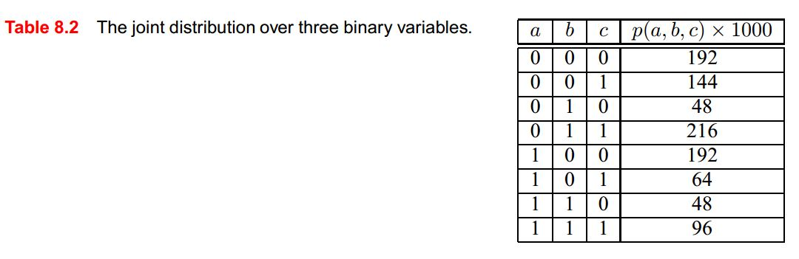
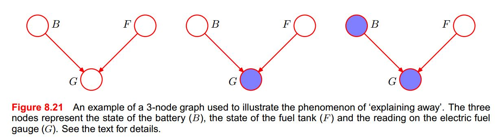
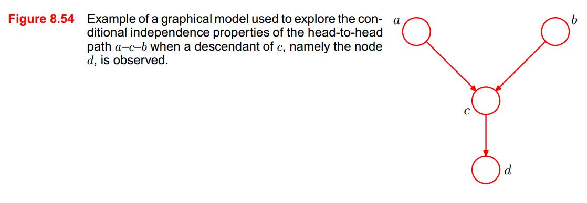

# 5.2 Interpreting Graphical Models

## Study Guide

The following revision of Bayes Theorem and joint probability are very relevant when it comes to understanding probabilistic graphical models. We have listed them here so that you can refer to them as you complete the readings for this session:

### Bayes Theorem Revision

**Definition of Conditional Probability:**

**Bayes Rule:**

**The (Corollary) Chain Rule:**

in full:

### Joint Probability Revision

- **Marginal** distribution: 

- **Independence:** X ⫫ Y  P(X, Y) = P(X)P(Y)
- **Conditional Independence:** X ⫫ Y | Z  P(X, Y|Z) = P(X|Z)P(Y|Z)

Once you have finished the readings you should be able to take a graphical model and write down the joint probability directly from it. You should also be able to do the reverse. For example, write down the graphical model for the distribution *P(X) P(Y|X) P(Z|X)*.

## Pre-class work

### 1. Bishop Textbook Exercises

The following exercises refer to **Table 8.2**, **Figure 8.2.1** and **Figure 8.54** which can be viewed below the exercise images.

#### Bishop Table and Figures

### 2. Flu in the Class:

We have a classroom containing N students all taking the same class during a flu epidemic. We assume that a student's probability of getting the flu only depends on the people that they interact with.

Consider the following models:

**A. General:** The general case occurs when we know nothing about which students meet and we decide to model all possible interactions (i.e. assuming that there is no conditional independence between any of the students.)

**B. Independence:** A much simpler model assuming full independence between every student. (This is equivalent to none of the students interacting with each other after class.)

**C. Groups:** A model in which every student belongs to a study group of 5 people.

**D. Tutors:** There are 10 class tutors in the class. Each student meets only one class tutor in isolation. The class tutors are drawn from the N students. There isn't enough time for a student to infect a tutor and the tutor to then infect another student.

For each model, do the following:

1. Write out the factorized joint probability P(X₁, X₂, …, Xᵢ), where each Xⱼ is a binary variable that can take the value "Sick" or "Healthy."
2. Show how this would be represented as a graphical model on a whiteboard (have an image of the model ready to share).
3. Calculate how many parameters would be required to fully specify the model.
